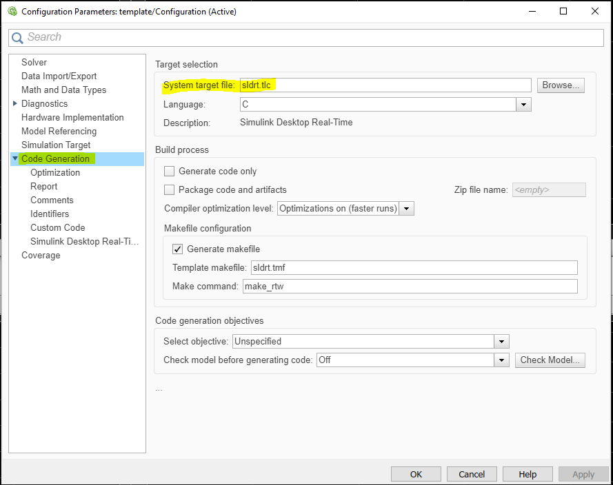
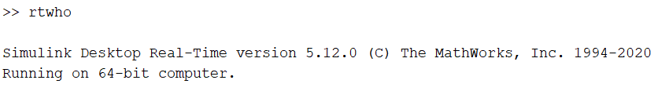
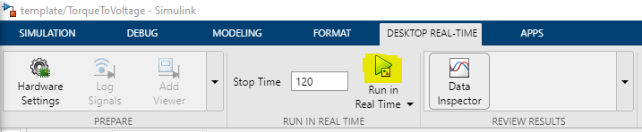
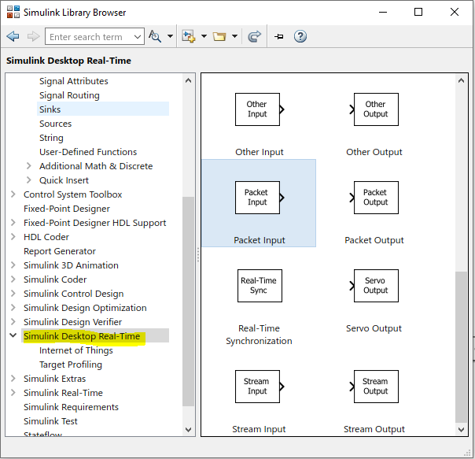
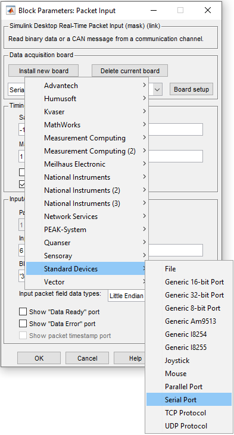
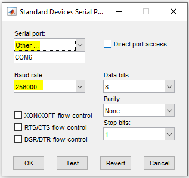
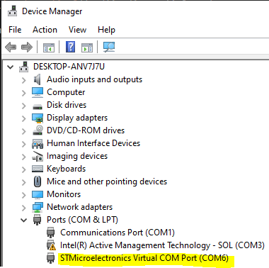
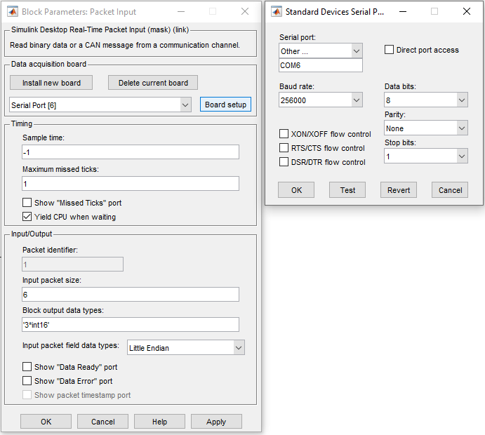
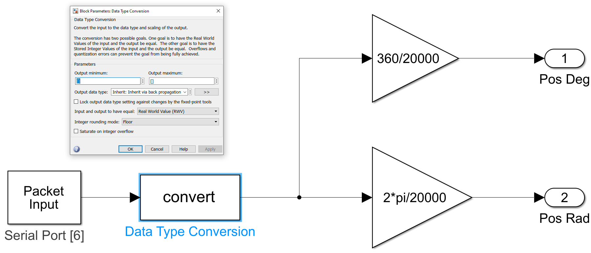
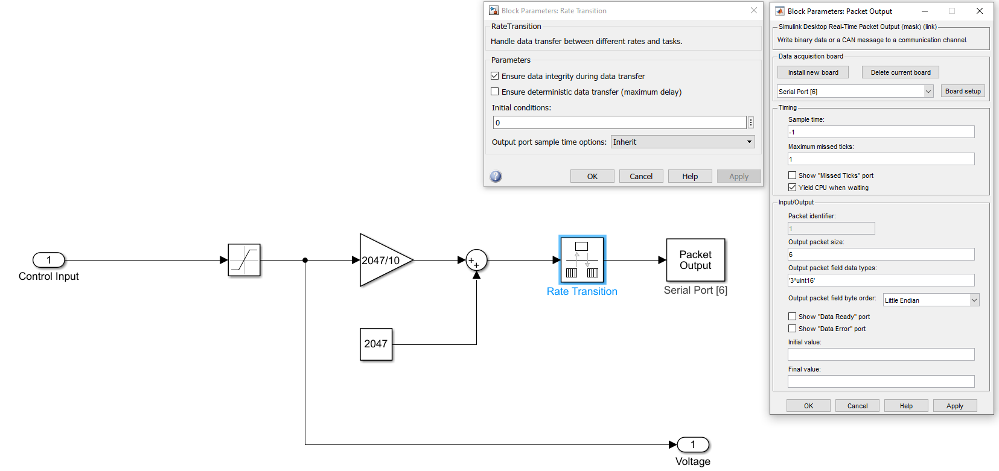

In this project, the control algorithms are executed in Simulink, with the data acquisition device interfacing with MATLAB through a serial COM port. Real-time communication is facilitated by the Real-Time Desktop package for MATLAB. To test new control algorithms, simply replace the controller block in the provided template.

The complete project repository is available on **GitHub**: [Roman3D Project Repo](https://github.com/sametgul/roman3d.git)



## Real-Time Desktop Kernel Setup

Install the Real-Time Desktop Kernel on the host computer by executing the following command in the MATLAB command window:
 ```
 sldrtkernel -install
 ```
To verify the installation, use the command:
```
rtwho
```
Example output:



## Simulink configuration
After creating a Simulink project, configure it for the real-time kernel by following these steps:

1. Go to Model settings.
2. Navigate to Code Generation.
3. Set the System target file to `sldrt.tlc`.


After this configuration, a new tab named ***Desktop Real-Time*** will appear in Simulink. Start simulations from this tab using the ***Run In Real Time*** button:



## Encoder Input Configuration

To communicate with the device, add a ***Packet Input*** block from the ***Simulink Desktop Real-Time Library***:



Install a new serial port board as shown:

 

 

Select the serial port according to the device manager:

 

Configure the device to send encoder input in 16-bit integer format at ***Block output data types***:

 

Now, convert the encoder input to radians. First, convert int16 to double using a convert block:

 

## DAC Output Configurations

To send DAC values to the device, use the ***Packet Output*** block from the ***Simulink Desktop Real-Time*** library. Calculate the real DAC value by converting +/- 10V to a 0-4096 range in MATLAB. Also, include a ***Rate Transition*** block before outputting DAC values:

 